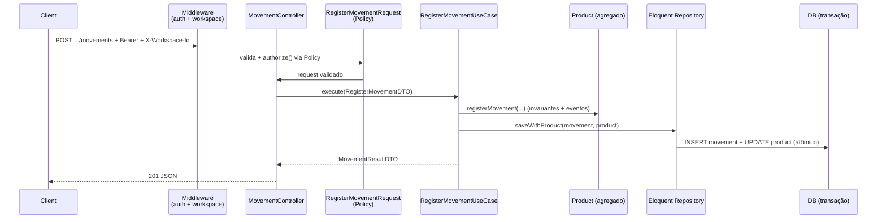

# Stockr API

[](https://github.com/ThQMS/stockr-api/actions/workflows/ci.yml)
[](https://www.php.net)
[](https://laravel.com)
[](https://phpstan.org)
[](LICENSE)

> **Parte do projeto Stockr** — backend REST. O app mobile que o consome
> (Flutter, com scanner de QR Code **offline-first**) está em
> **[stockr-app](https://github.com/ThQMS/Stockr-app-)**.

REST API pura para **gestão de estoque multi-workspace**: produtos, movimentações de
estoque (ledger imutável), leitura por QR Code e relatórios de inventário.

Construída em **Laravel 11 / PHP 8.4** seguindo **DDD com 4 camadas explícitas**
(Domain, Application, Infrastructure, Presentation), com PHPStan nível 8 e testes
em Pest.

> 📚 **Documentação completa em [`docs/`](docs/README.md)** — arquitetura, modelo
> de domínio, referência da API, autenticação, banco de dados e testes.

## Ecossistema Stockr

| Repo | Stack | Papel |
|---|---|---|
| **stockr-api** (este) | Laravel 11 · PHP 8.4 | Backend REST, fonte da verdade, OpenAPI |
| **[stockr-app](https://github.com/ThQMS/Stockr-app-)** | Flutter · Drift (SQLite) | App mobile: scanner de QR, **offline-first** com sync |

O diferencial do produto é o **fluxo offline-first**: o app lê o QR, registra a
movimentação localmente (Drift/SQLite) e **sincroniza com esta API** quando a
conexão volta — caso de uso real de warehouse onde a rede cai.

---

## Arquitetura

O código de domínio vive em `src/` sob o namespace `Stockr\` (autoload PSR-4:
`"Stockr\\": "src/"`). `app/` contém apenas bootstrap — o `AppServiceProvider` é o
*composition root* que liga as interfaces do Domínio às implementações de
Infraestrutura.

### Diagrama de camadas

As setas indicam a **direção de dependência**: as camadas externas dependem das
internas, nunca o contrário. O Domínio é o núcleo e não conhece ninguém.

```mermaid
flowchart TB
    subgraph PRES["🌐 Presentation"]
        C[Controllers]
        FR[Form Requests + Policies]
        RES[API Resources]
        MW[Middleware<br/>EnsureWorkspaceMember]
    end

    subgraph APP["⚙️ Application"]
        UC[Use Cases<br/>execute&#40;DTO&#41;]
        DTO[DTOs tipados]
    end

    subgraph DOM["💛 Domain (núcleo, zero framework)"]
        ENT[Entidades / Agregados<br/>Product · Movement]
        VO[Value Objects<br/>Money · ProductSku · StockQuantity]
        EVT[Domain Events]
        PORTS[(Interfaces / Ports<br/>Repositories · EventDispatcher)]
    end

    subgraph INFRA["🔌 Infrastructure"]
        REPO[Eloquent Repositories<br/>+ ProductMapper]
        MODEL[Eloquent Models]
        CACHE[RedisInventoryCache]
        QR[QrCode Adapter]
    end

    PRES --> APP
    APP --> DOM
    INFRA -. implementa .-> PORTS
    REPO --> MODEL
    APP -.usa.-> PORTS

    style DOM fill:#fdf6b2,stroke:#d4a017
    style APP fill:#e0f2fe,stroke:#0284c7
    style PRES fill:#dcfce7,stroke:#16a34a
    style INFRA fill:#fae8ff,stroke:#a21caf
```



### Fluxo de uma requisição (ex.: registrar movimento)



### Estrutura de pastas

```
src/
├── Domain/                      # Núcleo puro — zero Illuminate
│   ├── Inventory/
│   │   ├── Entities/            # Product (agregado), Movement, Category
│   │   ├── ValueObjects/        # Money, ProductSku, StockQuantity, MovementType, ProductStatus
│   │   ├── Events/              # ProductCreated, StockMovementRegistered, LowStockDetected
│   │   ├── Repositories/        # ProductRepositoryInterface, MovementRepositoryInterface
│   │   ├── Services/            # StockCalculator (puro)
│   │   ├── Collections/         # ProductCollection
│   │   ├── Contracts/           # QrCodeGeneratorInterface, InventoryCacheInterface
│   │   └── Exceptions/          # InsufficientStock, DuplicateSku, ProductNotFound...
│   ├── Auth/
│   │   ├── Entities/            # User, Workspace
│   │   ├── ValueObjects/        # Email, WorkspaceSlug
│   │   ├── Repositories/        # User/Workspace RepositoryInterface
│   │   └── Contracts/           # PasswordHasher, TokenIssuer, CredentialVerifier
│   └── Shared/                  # DomainEvent, EventDispatcherInterface
│
├── Application/                 # Orquestra o domínio — nunca importa Eloquent
│   ├── Inventory/
│   │   ├── UseCases/            # Create/Update/RegisterMovement/Scan/GenerateQrCode/GetReport
│   │   └── DTOs/                # CreateProductDTO, RegisterMovementDTO, MovementResultDTO...
│   └── Auth/
│       ├── UseCases/            # Register/Authenticate/SelectWorkspace
│       └── DTOs/                # RegisterUserDTO, AuthResultDTO
│
├── Infrastructure/              # Implementa as interfaces do Domínio
│   ├── Persistence/Eloquent/
│   │   ├── Models/              # ProductModel, MovementModel (imutável), ...
│   │   ├── Repositories/        # EloquentProductRepository, ...
│   │   └── Mappers/             # ProductMapper (Model → Entity)
│   ├── Persistence/Migrations/  # Migrations (carregadas pelo AppServiceProvider)
│   ├── Cache/                   # RedisInventoryCache (prefixo por workspace)
│   ├── QrCode/                  # SimpleSoftwareQrCodeAdapter
│   ├── Auth/                    # SanctumTokenIssuer, LaravelPasswordHasher...
│   └── Events/                  # LaravelEventDispatcherAdapter
│
└── Presentation/Http/
    ├── Controllers/Api/V1/      # Auth, Product, Movement, Report, Workspace
    ├── Requests/                # Form Requests (authorize via Policy) + messages()
    ├── Resources/               # ProductResource, MovementResource, WorkspaceResource
    └── Middleware/              # EnsureWorkspaceMember
```

**Regras de dependência (garantidas por testes de arquitetura em
`tests/Unit/ArchitectureTest.php`):**

- `Domain` nunca importa nada de `Illuminate`.
- `Application` nunca importa Eloquent.
- `Infrastructure` implementa as interfaces do `Domain`.
- `Presentation` apenas orquestra Use Cases — sem lógica de negócio.

### Decisões de design

- **IDs**: `products` usa **ULID** (string), gerado no domínio (`Product::create()`).
  `workspaces`, `users` e `categories` usam `id` inteiro auto-increment.
- **Dinheiro**: `Money` é armazenado em **centavos (int)**, nunca float
  (`cost_price_cents`, `sale_price_cents`).
- **Movimentos são imutáveis**: o `MovementModel` lança `LogicException` em
  `save()`/`update()` de um registro existente — só `create()` é permitido. A
  tabela carrega snapshots `quantity_before`/`quantity_after` (trilha de auditoria).
- **Autorização**: Policies (`ProductPolicy`, `MovementPolicy`) verificam
  *membership* no workspace; a regra de estoque insuficiente é invariante do
  agregado `Product`.

---

## Stack & pacotes

- `laravel/sanctum` — autenticação por token (Bearer)
- `spatie/laravel-query-builder` — filtros/ordenação na listagem de produtos
- `spatie/laravel-data` — DTOs de saída
- `spatie/laravel-route-attributes` — rotas declaradas via atributos nos controllers
- `dedoc/scramble` — OpenAPI 3.1 gerado automaticamente
- `simplesoftwareio/simple-qrcode` — geração de QR Code
- Dev: `pestphp/pest`, `larastan/larastan` (PHPStan 8), `barryvdh/laravel-ide-helper`

---

## Setup

> **Nesta máquina o Composer não está no PATH.** Use o `composer.phar` da raiz do
> projeto: `php composer.phar <comando>`.

```bash
# 1. Dependências
php composer.phar install

# 2. Ambiente (.env já vem com sqlite configurado)
php artisan key:generate

# 3. Banco (SQLite por padrão)
php artisan migrate

# 4. Servir
php artisan serve
```

As migrations ficam em `src/Infrastructure/Persistence/Migrations` (carregadas pelo
`AppServiceProvider`), não em `database/migrations`.

---

## Autenticação & workspace

1. `POST /api/v1/auth/register` ou `/login` → retorna um **token** Sanctum.
2. Envie o token em todas as chamadas protegidas: `Authorization: Bearer <token>`.
3. O workspace ativo é informado pelo header **`X-Workspace-Id: <id>`**. O
   middleware `workspace` (`EnsureWorkspaceMember`) garante que o usuário é membro.

```bash
curl -X POST http://localhost:8000/api/v1/products \
  -H "Authorization: Bearer $TOKEN" \
  -H "X-Workspace-Id: 1" \
  -H "Content-Type: application/json" \
  -d '{"name":"Compressor","cost_price":1200.50,"initial_stock":10,"minimum_stock":4}'
```

---

## Endpoints (`/api/v1`)

### Auth
| Método | Rota | Descrição |
|---|---|---|
| POST | `/auth/register` | Cria usuário + workspace, retorna token |
| POST | `/auth/login` | Autentica, retorna token |
| GET | `/auth/me` | Usuário autenticado |
| POST | `/auth/workspace` | Seleciona workspace ativo |
| POST | `/auth/logout` | Revoga tokens |

### Workspaces
| Método | Rota | Descrição |
|---|---|---|
| GET | `/workspaces` | Lista workspaces do usuário |
| POST | `/workspaces/select` | Seleciona workspace |
| GET | `/workspaces/{workspace}` | Detalha workspace |

### Produtos *(requer `X-Workspace-Id`)*
| Método | Rota | Descrição |
|---|---|---|
| GET | `/products` | Lista (filtros: `name`, `sku`, `category_id`, `low_stock`) |
| POST | `/products` | Cria produto (gera SKU se omitido) |
| GET | `/products/{product}` | Detalha |
| PUT | `/products/{product}` | Atualiza |
| DELETE | `/products/{product}` | Remove (soft delete) |
| POST | `/products/scan` | Resolve produto por código/QR + status + últimas movimentações |
| GET | `/products/{product}/qrcode` | Gera QR Code do produto |

### Movimentações *(requer `X-Workspace-Id`)*
| Método | Rota | Descrição |
|---|---|---|
| GET | `/products/{product}/movements` | Histórico do produto |
| POST | `/products/{product}/movements` | Registra movimento (`in`/`out`/`adjustment`/`transfer`) |

### Relatórios *(requer `X-Workspace-Id`)*
| Método | Rota | Descrição |
|---|---|---|
| GET | `/reports/summary` | Resumo do inventário (totais + linhas) |
| GET | `/reports/chart` | Série para gráfico (top por valor) |
| GET | `/reports/low-stock` | Produtos no/abaixo do mínimo |
| GET | `/reports/export` | Exporta CSV |

---

## Exemplos de payload

### `POST /api/v1/auth/register` → `201`
```json
{
  "userId": 1,
  "name": "Thiago",
  "email": "thiago@example.com",
  "token": "1|aBcD3f...plaintext-sanctum-token",
  "workspaceIds": [1]
}
```

### `POST /api/v1/products` → `201`
Resource encapsulado em `data`. `Money` vem como número **e** string formatada;
`StockQuantity` como int; `is_low_stock` calculado inline.
```json
{
  "data": {
    "id": "01J9Z8K7Q3M5X2P0R4T6V8W1Y3",
    "workspace_id": 1,
    "category_id": null,
    "sku": "COOL-001",
    "barcode": null,
    "name": "Compressor",
    "description": null,
    "unit": "un",
    "status": "active",
    "cost_price": 1200.5,
    "cost_price_formatted": "R$ 1.200,50",
    "sale_price": 0,
    "sale_price_formatted": "R$ 0,00",
    "current_stock": 10,
    "minimum_stock": 4,
    "is_low_stock": false,
    "qr_code_path": null
  }
}
```

### `POST /api/v1/products/{product}/movements` → `201`
```json
{
  "movementId": 7,
  "productId": "01J9Z8K7Q3M5X2P0R4T6V8W1Y3",
  "type": "out",
  "quantity": 7,
  "resultingStock": 3,
  "lowStockTriggered": true
}
```

### `POST /api/v1/products/scan` → `200`
```json
{
  "productId": "01J9Z8K7Q3M5X2P0R4T6V8W1Y3",
  "sku": "COOL-001",
  "name": "Compressor",
  "stock": 3,
  "price": 1200.5,
  "stockStatus": "low",
  "recentMovements": [
    { "id": 7, "type": "out", "quantity": 7, "notes": "Sale", "movedAt": "2026-06-22T15:04:05+00:00" }
  ]
}
```

### `GET /api/v1/reports/summary` → `200`
```json
{
  "workspaceId": 1,
  "totalProducts": 1,
  "totalUnits": 3,
  "totalStockValue": 3601.5,
  "lowStockCount": 1,
  "lines": [
    {
      "productId": "01J9Z8K7Q3M5X2P0R4T6V8W1Y3",
      "sku": "COOL-001",
      "name": "Compressor",
      "stock": 3,
      "reorderLevel": 4,
      "unitPrice": 1200.5,
      "lineValue": 3601.5,
      "isLowStock": true
    }
  ]
}
```

### Erros comuns
| Status | Quando |
|---|---|
| `401` | Sem token / token inválido |
| `403` | Token válido, mas não é membro do workspace (Policy) |
| `404` | Produto inexistente (`ProductNotFoundException`) |
| `409` | SKU duplicado no workspace (`DuplicateSkuException`) |
| `422` | Falha de validação do Form Request |

---

## Documentação OpenAPI

Gerada automaticamente pelo Scramble (config em `config/scramble.php`):

- **UI interativa**: `/docs/api`
- **JSON**: `/docs/api.json`
- Exportar arquivo: `php artisan scramble:export`

---

## Qualidade

```bash
# Code style (Laravel Pint)
vendor/bin/pint --test

# Análise estática (PHPStan nível 8 via Larastan)
vendor/bin/phpstan analyse --memory-limit=1G

# Testes (Pest)
php vendor/pestphp/pest/bin/pest
```

Estado atual: **28 testes / 77 asserts** verdes, PHPStan nível 8 sem erros, Pint
limpo. As três checagens rodam no **CI** ([`.github/workflows/ci.yml`](.github/workflows/ci.yml))
em PHP 8.4 a cada push e PR.

---

## Contribuindo

Contribuições são bem-vindas! Leia o **[CONTRIBUTING.md](CONTRIBUTING.md)** (fluxo
DDD, gate de qualidade) e o **[CODE_OF_CONDUCT.md](CODE_OF_CONDUCT.md)**. Para
vulnerabilidades, veja **[SECURITY.md](SECURITY.md)**.

Histórico de mudanças em **[CHANGELOG.md](CHANGELOG.md)**.

## Licença

Distribuído sob a licença **[MIT](LICENSE)**.
