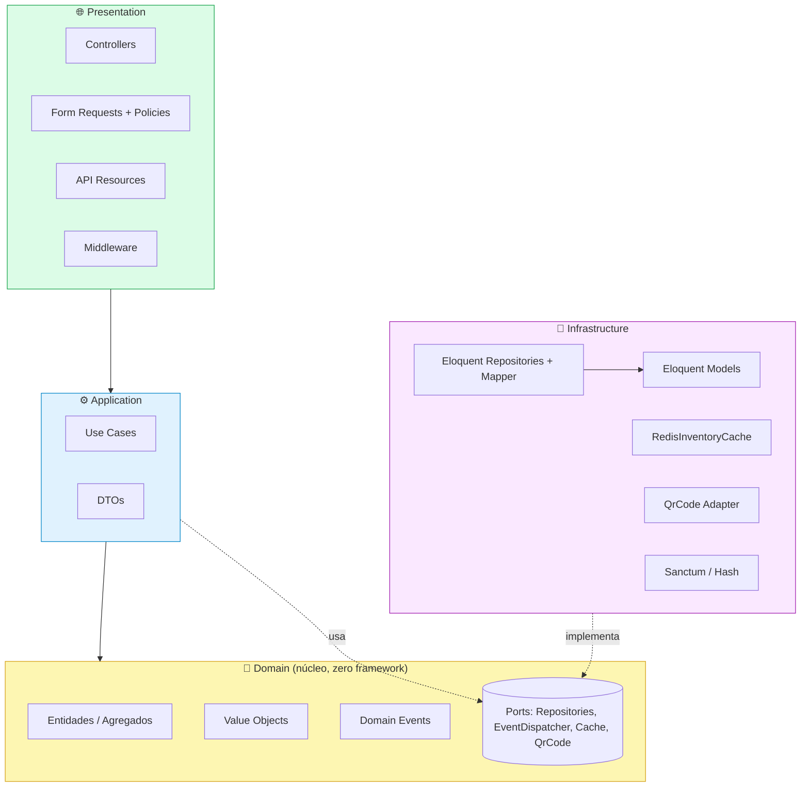

# 02 · Arquitetura

[← Índice](README.md)

O Stockr segue **Domain-Driven Design com 4 camadas explícitas**. O código de
domínio vive em `src/` sob o namespace `Stockr\`; `app/` contém apenas bootstrap
(o `AppServiceProvider` é o *composition root*).

## Camadas e direção de dependência



### Regras (garantidas por `tests/Unit/ArchitectureTest.php`)

| Regra | Significado |
|---|---|
| `Domain` não importa `Illuminate` | O núcleo é PHP puro, testável sem framework |
| `Application` não importa Eloquent | Casos de uso falam com *interfaces*, não com Models |
| `Infrastructure` implementa interfaces do `Domain` | Inversão de dependência |
| `Presentation` só orquestra Use Cases | Sem lógica de negócio em controllers |

O **Dependency Inversion** acontece via *ports* (interfaces no Domínio) e
*adapters* (implementações na Infraestrutura), conectados no `AppServiceProvider`.

## Responsabilidade de cada camada

### Domain (`src/Domain`)
O coração do sistema. Contém:
- **Entidades/Agregados** — `Product` (raiz de agregado), `Movement`, `Category`,
  `User`, `Workspace`. Carregam invariantes e comportamento.
- **Value Objects** — `Money`, `ProductSku`, `StockQuantity`, `MovementType`,
  `ProductStatus`, `Email`, `WorkspaceSlug`. Imutáveis e auto-validados.
- **Domain Events** — `ProductCreated`, `StockMovementRegistered`,
  `LowStockDetected` (todos implementam `DomainEvent`).
- **Ports** — interfaces de repositório, `EventDispatcherInterface`,
  `InventoryCacheInterface`, `QrCodeGeneratorInterface`, etc.
- **Serviços de domínio** — `StockCalculator` (puro, sem estado).

Detalhes em **[03 · Modelo de Domínio](03-domain-model.md)**.

### Application (`src/Application`)
Orquestra o domínio em **casos de uso** com um único método `execute()` que
recebe um DTO e retorna um DTO (ou entidade) — nunca um Model Eloquent.

```
Inventory/UseCases:
  CreateProductUseCase · UpdateProductUseCase · RegisterMovementUseCase
  ScanProductUseCase · GenerateProductQrCodeUseCase · GetInventoryReportUseCase
Auth/UseCases:
  RegisterUserUseCase · AuthenticateUserUseCase · SelectWorkspaceUseCase
```

DTOs são `readonly` com factories `from*()`. Os DTOs de saída de relatório usam
classes simples; alguns DTOs de auth usam `spatie/laravel-data`.

### Infrastructure (`src/Infrastructure`)
Implementa os *ports* do domínio:
- **Eloquent Models** — mapeamento puro (sem lógica). `MovementModel` é imutável.
- **Repositories** — convertem Model ↔ Entity via `ProductMapper`; retornam
  **sempre entidades de domínio**.
- **Adapters** — `RedisInventoryCache`, `SimpleSoftwareQrCodeAdapter`,
  `SanctumTokenIssuer`, `LaravelPasswordHasher`, `LaravelEventDispatcherAdapter`.

### Presentation (`src/Presentation`)
- **Controllers** finos (3 responsabilidades: validar, montar DTO, chamar use
  case e retornar Resource).
- **Form Requests** com `authorize()` via Policies e `rules()`/`messages()`.
- **API Resources** que nunca expõem campos internos desnecessários.
- **Middleware** `EnsureWorkspaceMember` resolve e valida o workspace ativo.

## Fluxo de uma requisição (registrar movimento)

```mermaid
sequenceDiagram
    participant Client
    participant MW as Middleware (auth + workspace)
    participant Req as RegisterMovementRequest (Policy)
    participant Ctrl as MovementController
    participant UC as RegisterMovementUseCase
    participant Agg as Product (agregado)
    participant Repo as Movement/Product Repository
    participant DB as DB (transação)

    Client->>MW: POST .../movements + Bearer + X-Workspace-Id
    MW->>Req: valida regras + authorize() (Policy de membership)
    Req->>Ctrl: request validado
    Ctrl->>UC: execute(RegisterMovementDTO)
    UC->>Agg: registerMovement() — aplica invariantes, grava eventos
    UC->>Repo: saveWithProduct(movement, product)
    Repo->>DB: INSERT movement + UPDATE product (atômico)
    UC->>UC: dispatch dos domain events; invalida cache do workspace
    UC-->>Ctrl: MovementResultDTO
    Ctrl-->>Client: 201 JSON
```

## Decisões de design

| Decisão | Racional |
|---|---|
| **IDs**: produtos em **ULID** (string); workspaces/users/categories em `int` | ULID dá identidade gerável no domínio sem round-trip ao banco; manter o resto em int contém o raio de mudança |
| **Money em centavos (int)** | Evita imprecisão de float; formatação só na borda (`toReais()`) |
| **Movimentos imutáveis** | `MovementModel::save()/update()` lançam `LogicException`; snapshots `quantity_before/after` formam trilha de auditoria |
| **Eventos acumulados no agregado** | `Product::pullDomainEvents()` é drenado pelo use case e despachado após persistir |
| **Roteamento via atributos** | `spatie/laravel-route-attributes`; rotas declaradas nos controllers |
| **Workspace via header** | `X-Workspace-Id` + middleware, em vez de path param |
| **Autorização via Policy** | `ProductPolicy`/`MovementPolicy` checam membership; regra de estoque fica no agregado |

## Composition root

Todos os *bindings* interface→implementação ficam em
`app/Providers/AppServiceProvider.php` (propriedade `$bindings` + método
`register()` para os que precisam de fábrica). As Policies são registradas no
`boot()` via `Gate::policy(...)`.

Próximo: **[03 · Modelo de Domínio →](03-domain-model.md)**
