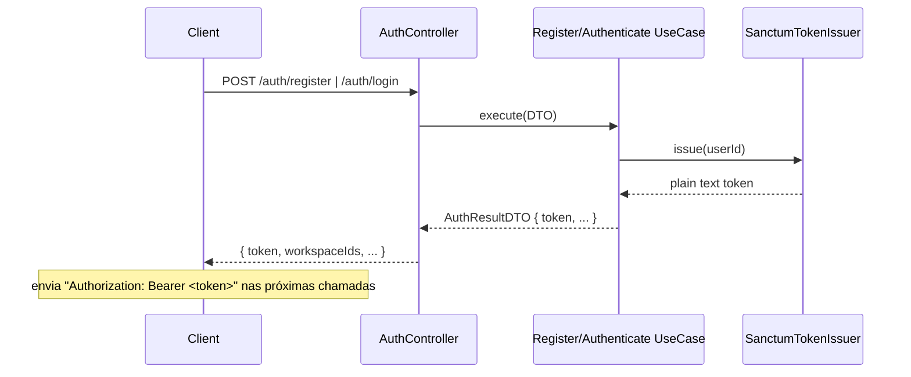

# 05 · Autenticação & Autorização

[← Índice](README.md)

## Autenticação (Laravel Sanctum)

A API usa **personal access tokens** do Sanctum (Bearer). O fluxo:



- O token é emitido pelo *port* `TokenIssuerInterface` → `SanctumTokenIssuer`.
- A verificação de credenciais usa `CredentialVerifierInterface` →
  `EloquentCredentialVerifier` (com comparação de hash em tempo ~constante).
- O hashing usa `PasswordHasherInterface` → `LaravelPasswordHasher`.
- `POST /auth/logout` revoga todos os tokens do usuário.

O modelo de identidade do Eloquent é
`Stockr\Infrastructure\Persistence\Eloquent\Models\UserModel` (configurado em
`config/auth.php`), que usa o trait `HasApiTokens`.

## Contexto de workspace (multi-tenant)

O Stockr é multi-workspace. O workspace ativo de uma requisição é informado pelo
header **`X-Workspace-Id`** (ou pelo parâmetro de rota `workspace`, quando houver).

O middleware **`EnsureWorkspaceMember`** (alias `workspace`, registrado em
`bootstrap/app.php`):
1. Lê o id do workspace do header/rota.
2. Verifica via `WorkspaceRepositoryInterface::isMember(...)` que o usuário
   autenticado pertence ao workspace.
3. Em caso afirmativo, fixa `workspaceId` nos atributos do request; senão, `403`.

```bash
curl -X GET http://localhost:8000/api/v1/products \
  -H "Authorization: Bearer <TOKEN>" \
  -H "X-Workspace-Id: 1"
```

## Autorização (Policies)

Além do middleware, os **Form Requests** autorizam via Policies, dando uma camada
explícita e testável de permissão por ação.

| Policy | Habilidades | Regra |
|---|---|---|
| `ProductPolicy` | `viewAny`, `view`, `create`, `update`, `delete` | usuário é membro do workspace |
| `MovementPolicy` | `viewAny`, `create` | usuário é membro do workspace |

Registro (em `AppServiceProvider::boot`):
```php
Gate::policy(ProductModel::class, ProductPolicy::class);
Gate::policy(MovementModel::class, MovementPolicy::class);
```

Uso no Form Request (ex.: `StoreProductRequest`):
```php
public function authorize(): bool
{
    $workspace = $this->activeWorkspace();              // trait ResolvesWorkspace
    return $workspace !== null
        && (bool) $this->user()?->can('create', [ProductModel::class, $workspace]);
}
```

> A regra "não pode dar saída maior que o estoque" **não** é uma policy — é um
> invariante do agregado `Product` (`InsufficientStockException`), mantendo a
> única fonte de verdade no domínio.

## Camadas de proteção (resumo)

```
Request → auth:sanctum (token válido?) 
        → workspace (é membro? — middleware)
        → Form Request authorize() (Policy da ação)
        → Use Case (re-confirma getWorkspaceId() no agregado)
```

Próximo: **[06 · Banco de Dados →](06-database.md)**
