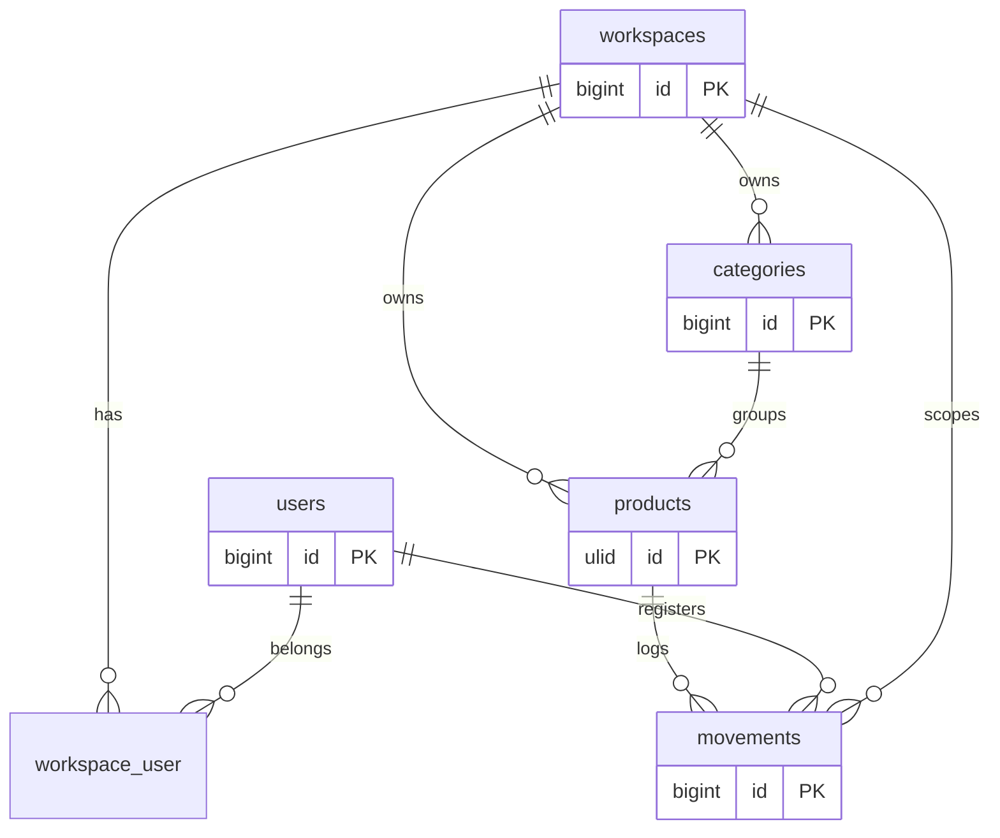

# 06 · Banco de Dados

[← Índice](README.md)

Banco padrão: **SQLite** (zero configuração). As migrations vivem em
`src/Infrastructure/Persistence/Migrations` e são carregadas pelo
`AppServiceProvider::boot()`.

## Diagrama de entidades



## Tabelas

### `workspaces`
| Coluna | Tipo | Notas |
|---|---|---|
| `id` | bigint PK | |
| `name` | string | |
| `slug` | string unique | |
| `owner_id` | FK → users | |

### `workspace_user` (pivot)
Membros de cada workspace: `workspace_id`, `user_id` (`role`, default `member`),
unique `[workspace_id, user_id]`.

### `categories`
`id`, `workspace_id` (FK), `name`, `description?`, unique `[workspace_id, name]`.

### `products`
Identidade **ULID** (gerada no domínio). Soft deletes.

| Coluna | Tipo | Notas |
|---|---|---|
| `id` | ulid PK | |
| `workspace_id` | FK → workspaces | cascade on delete |
| `category_id` | FK → categories null | null on delete |
| `name` | string(200) | |
| `description` | string null | |
| `sku` | string(30) | único por workspace |
| `barcode` | string(100) null | EAN-13, QR ou custom |
| `current_stock` | uint | default 0 |
| `minimum_stock` | uint | limite de alerta |
| `cost_price_cents` | ubigint | **centavos** |
| `sale_price_cents` | ubigint | **centavos** |
| `unit` | string(10) | `un`, `kg`, `l`, `cx`, `pc` |
| `status` | string(20) | `active`/`inactive`/`discontinued` |
| `qr_code_path` | string null | |
| `timestamps` + `softDeletes` | | |

Índices: unique `[workspace_id, sku]`, `[workspace_id, status]`,
`[workspace_id, current_stock]`.

### `movements`
Ledger **imutável** (write-once, sem `updated_at`).

| Coluna | Tipo | Notas |
|---|---|---|
| `id` | bigint PK | |
| `workspace_id` | FK → workspaces | |
| `product_id` | FK ulid → products | **restrict on delete** |
| `user_id` | FK → users | |
| `type` | string(20) | `in`/`out`/`adjustment`/`transfer` |
| `quantity` | int | sempre positivo; o tipo define a direção |
| `quantity_before` | uint | snapshot antes |
| `quantity_after` | uint | snapshot depois |
| `notes` | text null | |
| `reference_code` | string(100) null | NF, PO, etc. |
| `moved_at` | timestamp | momento real do movimento |
| `created_at` | timestamp | |

Índices: `[product_id, moved_at]`, `[workspace_id, moved_at]`,
`[workspace_id, type]`.

> A imutabilidade é reforçada na aplicação: `MovementModel::save()`/`update()`
> lançam `LogicException` para qualquer alteração de registro já existente — só
> `create()` (insert puro) é permitido. Coberto por
> `tests/Feature/MovementModelImmutabilityTest.php`.

## Comandos

```bash
php artisan migrate          # aplica migrations pendentes
php artisan migrate:fresh    # recria tudo do zero
php artisan migrate:status   # estado das migrations
```

Próximo: **[07 · Testes & Qualidade →](07-testing.md)**
